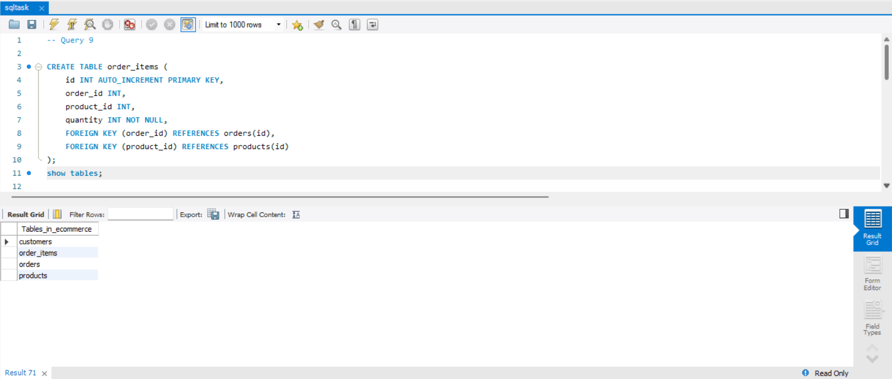

# SQL TASK

- Create a database and tables to manage a simple e-commerce system.
  The system should have three tables: customers, orders, and products.

## Table of Contents
|S. No|Titles|
|-----|------|
|1.|[Task Details](#task-details)|
|2.|[Create database](#create-database)|
|3.|[Create tables](#create-tables)|
|4.|[Insert sample data to the tables](#insert-sample-data-to-the-tables)|
|5.|[Queries to Write..?](#queries-to-write)|
|6.|[Queries..!](#queries)|

## Task Details

- Create a database named ecommerce.
- Create three tables: customers, orders, and products.
- Insert some sample data into the tables.
- Write the queries for the given [problems](#queries-to-write)

## Create database

```sql
    CREATE DATABASE ecommerce;
    USE ecommerce;
```

### Result Screenshot


## Create tables

1. Products

```sql
    CREATE TABLE products (
    id INT AUTO_INCREMENT PRIMARY KEY,
    name VARCHAR(100) NOT NULL,
    price DECIMAL(10, 2) NOT NULL,
    description TEXT
);
```

2. Customers

```sql
    CREATE TABLE customers (
    id INT AUTO_INCREMENT PRIMARY KEY,
    name VARCHAR(100) NOT NULL,
    email VARCHAR(100) UNIQUE NOT NULL,
    address VARCHAR(255) NOT NULL
);
```

3. Orders

```sql
    CREATE TABLE orders (
    id INT AUTO_INCREMENT PRIMARY KEY,
    customer_id INT,
    order_date DATE NOT NULL,
    total_amount DECIMAL(10, 2) NOT NULL,
    FOREIGN KEY (customer_id) REFERENCES customers(id)
);
```

### Result Screenshot


## Insert sample data to the tables

1. Products

```sql
    INSERT INTO products (name, price, description)
    VALUES
        ('Product A', 20.00, 'Description for Product A'),
        ('Product B', 35.00, 'Description for Product B'),
        ('Product C', 50.00, 'Description for Product C');
```

### Result Screenshot


2. Customers

```sql
    INSERT INTO customers (name, email, address)
    VALUES
        ('Alice Smith', 'alice@example.com', '123 Maple St'),
        ('Bob Johnson', 'bob@example.com', '456 Oak St'),
        ('Charlie Brown', 'charlie@example.com', '789 Pine St');
```

### Result Screenshot


3. Orders

```sql
    INSERT INTO orders (customer_id, order_date, total_amount)
    VALUES
        (1, CURDATE() - INTERVAL 10 DAY, 75.00),
        (2, CURDATE() - INTERVAL 20 DAY, 150.00),
        (3, CURDATE() - INTERVAL 40 DAY, 200.00);
```

### Result Screenshot


## Queries to Write

1. [Retrieve all customers who have placed an order in the last 30 days.](#a1)
2. [Get the total amount of all orders placed by each customer.](#a2)
3. [Update the price of Product C to 45.00.](#a3)
4. [Add a new column discount to the products table.](#a4)
5. [Retrieve the top 3 products with the highest price.](#a5)
6. [Get the names of customers who have ordered Product A.](#a6)
7. [Join the orders and customers tables to retrieve the customer's name and order date for each order.](#a7)
8. [Retrieve the orders with a total amount greater than 150.00.](#a8)
9. [Normalize the database by creating a separate table for order items and updating the orders table to reference the order_items table.](#a9)
10. [Retrieve the average total of all orders.](#a10)

## Queries

## A1

```sql
    SELECT DISTINCT c.*
    FROM customers c
    JOIN orders o ON c.id = o.customer_id
    WHERE o.order_date >= CURDATE() - INTERVAL 30 DAY;
```

### Result Screenshot


[back to Queries to Write](#queries-to-write)

## A2

```sql
    SELECT c.name, SUM(o.total_amount) AS total_spent
    FROM customers c
    JOIN orders o ON c.id = o.customer_id
    GROUP BY c.id;
```

### Result Screenshot


[back to Queries to Write](#queries-to-write)

## A3

```sql
    UPDATE products
    SET price = 45.00
    WHERE name = 'Product C';
```

### Result Screenshot


[back to Queries to Write](#queries-to-write)

## A4

```sql
    ALTER TABLE products
    ADD COLUMN discount DECIMAL(5, 2) DEFAULT 0.00;
```

### Result Screenshot


[back to Queries to Write](#queries-to-write)

## A5

```sql
    SELECT *
    FROM products
    ORDER BY price DESC
    LIMIT 3;
```

### Result Screenshot


[back to Queries to Write](#queries-to-write)

## A6

```sql
    SELECT DISTINCT c.name
    FROM customers c
    JOIN orders o ON c.id = o.customer_id
    JOIN products p ON o.id = p.id
    WHERE p.name = 'Product A';
```

### Result Screenshot


[back to Queries to Write](#queries-to-write)

## A7

```sql
    SELECT c.name AS customer_name, o.order_date
    FROM customers c
    JOIN orders o ON c.id = o.customer_id;
```

### Result Screenshot


[back to Queries to Write](#queries-to-write)

## A8

```sql
    SELECT *
    FROM orders
    WHERE total_amount > 150.00;
```

### Result Screenshot


[back to Queries to Write](#queries-to-write)

## A9

```sql
    CREATE TABLE order_items (
        id INT AUTO_INCREMENT PRIMARY KEY,
        order_id INT,
        product_id INT,
        quantity INT NOT NULL,
        FOREIGN KEY (order_id) REFERENCES orders(id),
        FOREIGN KEY (product_id) REFERENCES products(id)
    );
```

### Result Screenshot


[back to Queries to Write](#queries-to-write)

## A10

```sql
    SELECT AVG(total_amount) AS average_order_total
    FROM orders;
```

### Result Screenshot


[back to Queries to Write](#queries-to-write)
